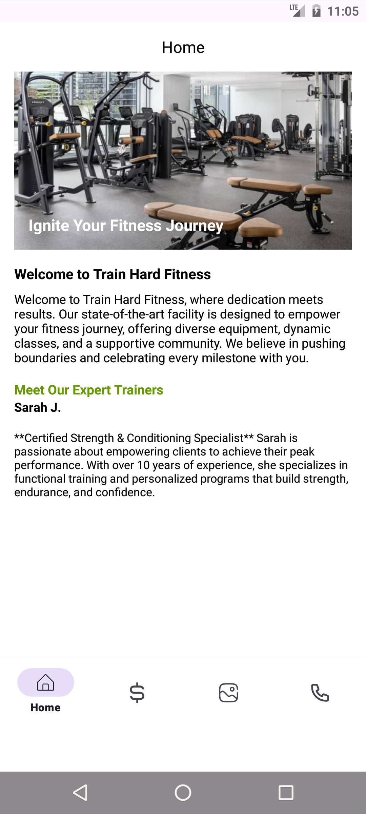

# 🏋️‍♂️ GymApp

A simple Android application built using **Kotlin** and **Fragments**, designed to provide an easy way for gym users to connect with the gym.  
The app includes contact options like **Call**, **WhatsApp**, **Location**, and **Instagram**, along with a clean UI for better user experience.

---

## 🚀 Features
- 📱 **Modern UI** with multiple fragments
- 📞 Direct **Call** button
- 💬 **WhatsApp** integration
- 📍 Open **Location** in Google Maps
- 📸 Link to official **Instagram** page
- 🎨 Custom layouts with responsive design

---

## 🛠️ Tech Stack
- **Language:** Kotlin
- **IDE:** Android Studio
- **Architecture:** Fragments-based navigation
- **UI:** XML Layouts, ConstraintLayout

---

## 📸 Screenshots

### Splash Screen  

### Home Page  

### Plans Page

### Gallery Page

### Contact Page

